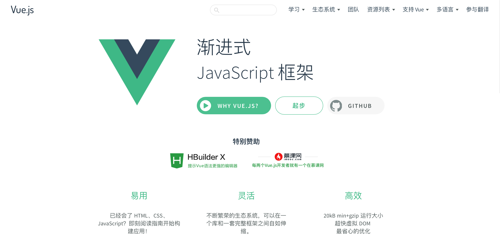
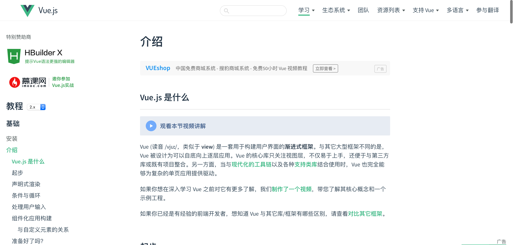
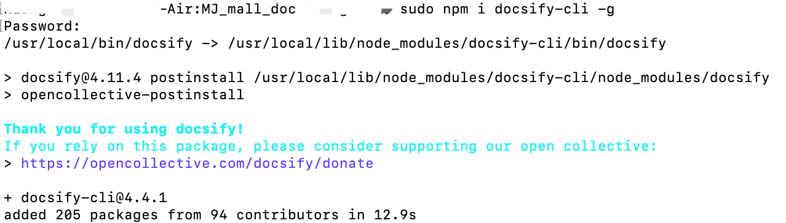
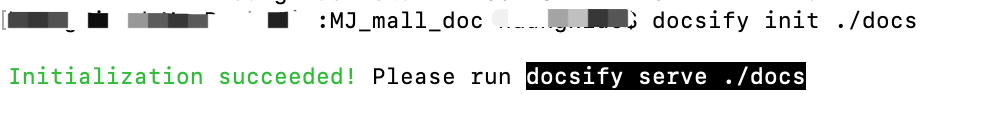
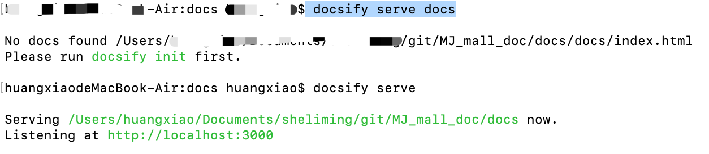
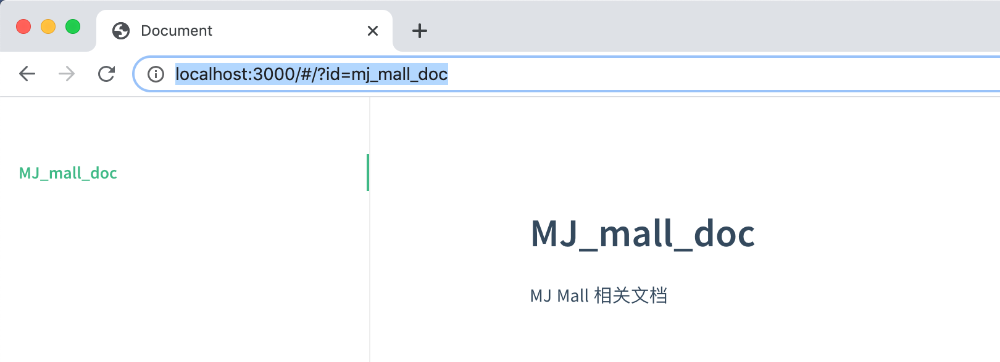
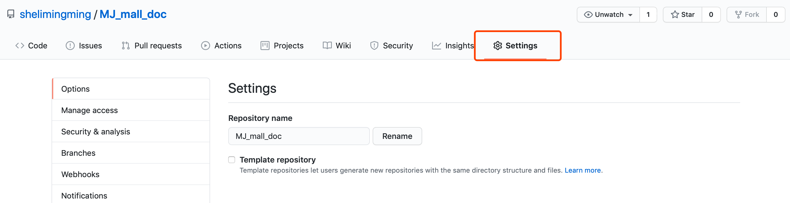
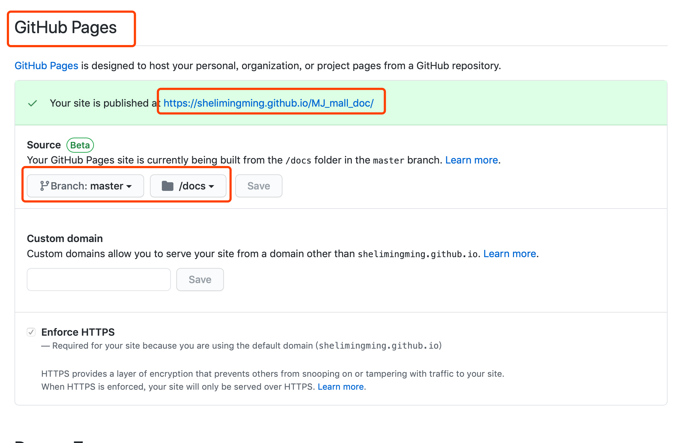
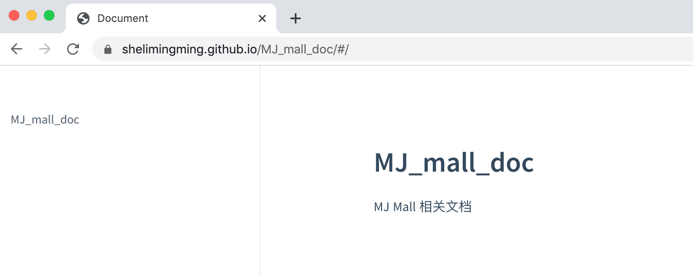
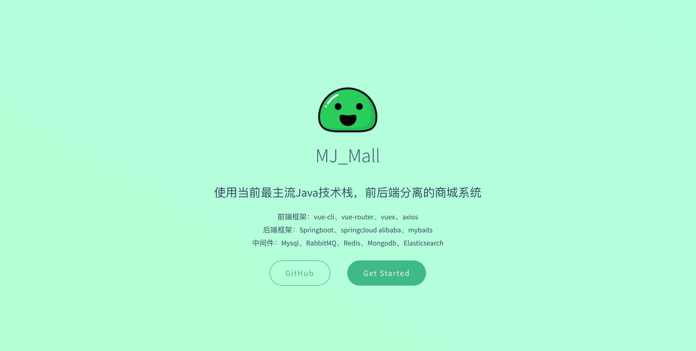

# Github+docsify零成本轻松打造在线文档网站

# 一、docsify使用背景

一个好的开源软件必须要有一个完善的文档才容易被推广，那么我们在如何简单、高效、低成本的搭建一个文档网站呢？今天我们使用Github+docsify来零成本轻松打造一个在线文档系统！

不同于 GitBook、Hexo 的地方是它不会生成静态的 `.html` 文件，所有转换工作都是在运行时。只需要创建一个 `index.html` 就可以开始编写文档并直接[部署在 GitHub Pages](https://docsify.js.org/#/zh-cn/deploy)。

vue的官方文档也是使用docsify搭建的：https://cn.vuejs.org

效果如下：





# 二、安装docsify

## 1、安装node和npm

这就不详细说了，网上一搜一大堆。这边给个链接。

https://www.cnblogs.com/xilifeng/p/5538711.html

## 2、全局安装docsify

```shell
npm i docsify-cli -g
```

注：mac中需要使用root权限，需要加上sudo。



# 三、使用docsify创建文档网站

## 1、在github中新建一个项目

这个项目用来存放我们的文档内容，后面通过github来发布我们的文档网站。关于github上如何创建项目，如何clone到本地，这里就不详细说了。

将项目clone到本地:

`git clone https://github.com/shelimingming/MJ_mall_doc.git`

## 2、初始化项目

进入clone的项目中执行：

```shell
docsify init ./docs
```



会自动生成一下几个文件：

```
index.html 入口文件
README.md 会做为主页内容渲染
.nojekyll 用于阻止 GitHub Pages 会忽略掉下划线开头的文件
```

## 3、本地启动项目

```shell
docsify serve docs
```



本地访问http://localhost:3000即可看到文档：



# 四、通过github发布文档

### 1、将生成的代码提交到github中

```shell
git add ./
git commit -m "初始化页面"
git push
```

## 2、设置GitHub Pages

在Settings中的GitHub Pages中选择docs文件夹，点击保存，即可发布刚刚的文档网站。通过https://shelimingming.github.io/MJ_mall_doc/地址即可访问！





至此，我们就零成本在公网上搭建了一个自己的文档网站了！！



# 五、docsify详细使用

## 1、设置封面

docsify可以很容易的给文档网站加上一个好看的封面。

首先在生成的index.html中增加：

```html
<script>
  window.$docsify = {
    coverpage: true
  }
</script>
<script src="//cdn.jsdelivr.net/npm/docsify/lib/docsify.min.js"></script>
```

然后在文档根目录创建 `_coverpage.md` 文件：

```markdown


# MJ_Mall

> 使用当前最主流Java技术栈，前后端分离的商城系统

* 前端框架：vue-cli、vue-router、vuex、axios
* 后端框架：Springboot、springcloud alibaba、mybaits
* 中间件：Mysql、RabbitMQ、Redis、Mongodb、Elasticsearch

[GitHub](https://github.com/shelimingming/MJ_Mall.git)
[Get Started](#quick-start)
```

这样就可以创建出一个颜色随机的好看的封面了！



## 2、多页文档

首先在生成的index.html中增加：

```html
<script>
  window.$docsify = {
    loadNavbar: true
  }
</script>
<script src="//cdn.jsdelivr.net/npm/docsify/lib/docsify.min.js"></script>
```

然后在文档根目录创建 `_coverpage.md` 文件：

```markdown
* [项目介绍](zh-cn/项目介绍.md)
* **设计文档**
  * [接口文档](zh-cn/设计文档/接口文档.md)
  * [数据库设计](zh-cn/设计文档/数据库设计.md)
* **技术博客**
 * [Github+docsify零成本轻松打造在线文档网站](zh-cn/技术博客/Github+docsify零成本轻松打造在线文档.md)
```

当前的目录结构

